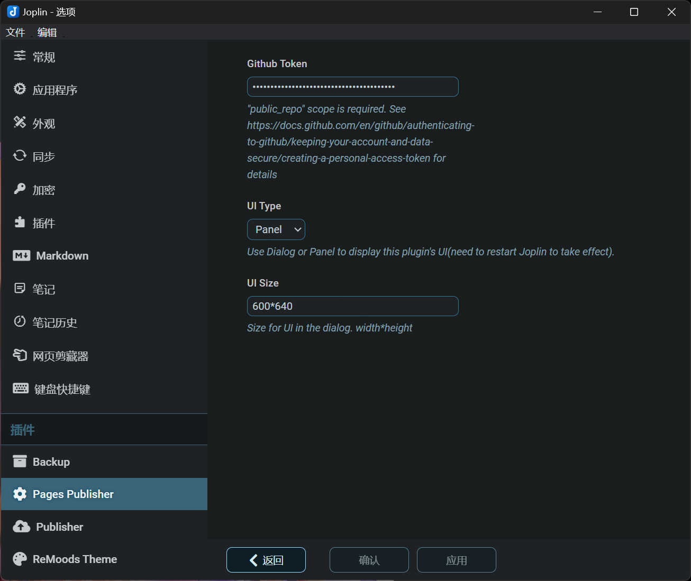

---
title: "Starting from Scratch: Building and Publishing a Hexo Static Blog with Joplin in 3 Minutes"  
slug: "joplin-publish-to-hexo-blog"  
date: "2024-06-05"  
categories: 
  - "network"  
tags: 
  - "Joplin"
  - "hexo"
  - "github"
  - "obsidian"
  - "hugo"
  - "blog"
  - "cloudflare"
  - "tutorials"
  - "Github Pages"
image: "joplinapp.jpg"  
---

Joplin is my favorite open-source note-taking application. Since I started using it in 2018, I have recorded hundreds of thousands of words in Joplin, occasionally using it to create blog posts. However, due to the limited plugin library of Joplin, it has always been challenging to directly publish articles to a blog from Joplin. That was until recently, when I came across a new Publisher plugin released by developer [rxliuli](https://blog.rxliuli.com/) , which piqued my interest, leading me to write this tutorial. You can also directly refer to the author's [plugin documentation](https://joplin-utils.rxliuli.com/en-US/joplin-publisher/) , which will yield the same results.  


Over the years, I have rarely written tutorials on web applications, but this time it was unexpected. I believe this method is currently the most convenient and visual solution for static blog applications, with several significant advantages over other solutions:  


- **Lightning-fast "zero-code" deployment of static blogs** (deployed via the Joplin Publisher plugin)
- **Exceptionally excellent Markdown editor** (edited within the Joplin app)
- **Visual blog category and directory management system** (managed within the Joplin app)
- **Simplest method for submitting updates to static blogs** (submitted via the Joplin Publisher plugin)
- **No need to set up Front Matter**(automatically converted by the Joplin Publisher plugin)
- **Minimalist image referencing and management** (simply paste or drag images into the Joplin editor)
- **No coding knowledge required, no need for VS Code, no need for Git**. (After setting up the blog website, all operations are performed within Joplin)


<br>

---

## The Process of Creating and Publishing a Hexo Blog with Joplin (For Experienced Users)  

Creating and publishing a Hexo blog with Joplin is incredibly straightforward, requiring just three simple steps:

1. Fork the [Joplin Blog Template](https://github.com/joplin-utils/joplin-blog-template) repository on Github, which comes pre-equipped with Hexo auto-deployment and the Fluid theme.  
2. Install the [Publisher plugin](https://github.com/rxliuli/joplin-utils/releases/download/joplin-publisher%401.0.0/joplin-publisher.jpl) in Joplin and bind it to a Github Token.  
3. Add a `Blog` tag to your Joplin notes, and then click "Publish to Github."。  
 
[](https://www.fosu.cc)
<br>

> For those who have experience with static blogs like Hexo or Hugo, this is the entire process of creating and publishing a Hexo blog using Joplin. It's unbelievably simple, taking less than three minutes in total, including the time for Github Actions to handle auto-deployment.


---

## Detailed Method for Creating and Publishing a Hexo Blog with Joplin (For Beginners)  

The following is a beginner's tutorial, which is also straightforward for users with no prior experience. The process is essentially "zero-code," and there is no need to use tools like VS Code and Git. It is believed that users with no prior experience can complete it within 20 minutes.


### Step 1: Install the Joplin Publisher Plugin  

Since this plugin has just been released, it is not yet included in the official Joplin plugin library. You need to download the plugin from Github and choose to install it from a local file. In the future, it should be possible to search and install it directly from the official plugin library.


Download Page: [Joplin Utils](https://github.com/rxliuli/joplin-utils/releases)
Download Link: [Joplin Publisher v1.0.0](https://github.com/rxliuli/joplin-utils/releases/download/joplin-publisher%401.0.0/joplin-publisher.jpl)


  
<br>

### Step 2: Create a Github Repository

1. **Prepare Your Account**  
   If you don't have a Github account, you can easily register one, which is similar to registering on any other website. After logging in, open the [Joplin Blog Template](https://github.com/joplin-utils/joplin-blog-template)  page and select "Use this template, Create a new repository."   


<br>

2. **Create the Repository**  
   On the create repository page, fill in the "Repository name," which should end with `.github.io`. If this is your first time using Github Pages, it's recommended to directly enter your `username.github.io`. For example, my username is `h2dcc`, I would enter `h2dcc.github.io`. ***This setting is crucial unless you plan to use a custom domain, in which case you must enter the name in this format.***


<br>

3. **Modify Repository Settings**  
   After opening the repository, go to "Settings" and select "Pages" on the left. Change `Build and deployment` to `Github actions.`

   


<br>

  Wait a few seconds, refresh the page, and you will now see the external access link for your blog.


  
> If you used the same address as your Github username in the "Create repository" step, the displayed address will be that username. For example, my username is h2dcc and I entered `h2dcc.github.io` in step two, the access address here would be `h2dcc.github.io`. If you entered a different name, a longer link will be generated. However, this longer link will cause a page loop error when publishing to Hexo using the Joplin plugin, unless it is changed to a custom domain. For instance, as shown in the image above, I have set `www.fosu.cc` as my custom domain.


<br>

### Step 3: Publish Blog Posts in Joplin  

1. **Obtain a Key from Github**  
   Open [https://github.com/settings/tokens/new](https://github.com/settings/tokens/new), click `Generate new token`, enter a memorable name, set the duration, and then check the first `repo` option. Scroll to the bottom of the page and click `Generate token`. Then, on the redirected page, copy the Token.

   
> The usual way to access this page is by clicking your profile picture on Github, then going to Settings - Developer settings - Tokens (Classic).


  
<br>


<br>
*Note: The key will only be displayed once immediately after generation. If you miss it, you'll need to generate a new one.*
<br>

2. **Enter the Github Authentication Key in Joplin**  
Input the key obtained in the previous step, along with your Github username and the repository name, which is the name you created in the "Create repository" step of the second part.


<br>

3. **Publish a Blog from Joplin Notes to Hexo**  
Add a `Blog` tag to the note you want to publish to Hexo, then click "Tools - Publish to Github" in Joplin. Wait a moment, and you will be able to view the website content through the `username.github.io` page mentioned in the second step above.


  
<br> 


  
<br>


  
<br>

> That concludes the entire process of publishing to a Hexo static blog using Joplin. At this point, the setup and publishing method for a static blog are complete. It truly achieves a "zero-code" process, without the need for IDE tools or Git.


*For information on website configuration, I will include it in the [final section of this article](#part-last).*

---

For comparison, let me elaborate a bit more on the traditional process of publishing notes to a static blog. Although it's unrelated to the main topic of this article, it allows us to see just how simple it is to publish to a static blog using Joplin.


## Traditional Note-to-Staic Blog Publishing Mode 


###  1.Set Up the Blog Environment  
   For static blogs like Hugo and Hexo, I believe most people start by setting up a local runtime environment.  

   > I have never taken a systematic computer science course, and my use of many web tools began with setting up a Hugo blog.

     
   Recalling the past, after reading the Hugo official documentation countless times, I finally ran `hugo server` for the first time on my Windows computer. I used Dart Sass, Git, Go, Mercurial, Chocolatey, and other tools for the first time, so you can imagine the resistance I faced. Just dealing with Git took a long time, with issues here and there, and getting it to run on my computer was a feat in itself.


<br>

### 2.Write Blog Posts Using IDE Software like VS Code  
   Obviously, I am using VS Code to write this article. I previously liked using Notepad++ or other editors, and I also wrote a tutorial on [how to publish a Hugo blog on an Android phone](https://hyruo.com/en/tags/hugo/). However, since Joplin does not support the Frontmatter format, I couldn't directly edit the required MD files for the blog in Joplin before; I had to process them again using VS Code.

   > Since Joplin stores notes in a database storage mode, Markdown files and image references are separated. Directly copying notes from Joplin to VS Code would result in incorrect image links.

However, for beginners, especially those not in the computer industry or enthusiasts, tools like VS Code can be daunting. The initial setup alone can be overwhelming.


<br>


### 3.Publish to Code Hosting Platforms like Github and Gitee  
   Static blog files are usually hosted on code hosting platforms like Github and Gitee. To be honest, these platforms are mostly familiar to those in the IT and internet industries, while other internet users rarely have direct contact with them. Many are at a loss on how to use Git to submit files and often encounter network issues. Especially earlier this year, Gitee `码云` directly stopped its Gitee Pages service, further increasing the difficulty of deploying static blogs in China.


   
   **There are generally three ways to host a static website on Github:**  

   1. Generate static website files locally and submit them to Github via Git for direct static deployment. This is the most straightforward method when there are fewer files. At this point, the Github repository acts like a virtual host, requiring no additional burden, just using the simplest routing and file functions.

 
   
   2. Use Github Actions to generate static website files online. Upload the source code of the static website to Github, which will compile the static files and deploy them. For a blog, this method only requires submitting new articles and images each time, and Github will automatically generate static web files immediately.

  
   
   3. Use static deployment services like Vercel, Cloudflare, NetLify, etc. These mainly replace Github Actions. When these services detect changes in the Github repository files, they automatically pull updates and generate static web pages. The main difference lies in network speed issues. However, this is somewhat unpredictable; sometimes Github Pages is faster, and sometimes Cloudflare Pages is faster. For example, this blog is currently hosted on Vercel, and the connection speed in China is generally within 1 second.


<br>

---

## Using Obsidian Software Publish to Hugo  

   The above section briefly introduced the conventional methods of using Hugo and Hexo static blogs. For comparison, I will also reference the method of using Obsidian to publish to Hugo and other static blogs.

   It is recommended to directly watch the following three articles from the `胡说` blog:

   1. [Best Practices for Writing a Hugo Blog](https://blog.zhangyingwei.com/posts/2022m4d11h19m42s28/)
   2. [Recommended Best Configuration for Obsidian + Hugo](https://blog.zhangyingwei.com/posts/2022m4d12h13m13s22/)
   3. [Transforming Obsidian into an Integrated Management Platform for Hugo Blogs](https://blog.zhangyingwei.com/posts/2024m1d30h10m7s52/)

I tried using this method to publish a blog last month. However, one drawback of this method is that you must first have a Hugo blog set up on Github. Additionally, this method relies on multiple plugins in Obsidian, and the process requires continuous debugging to make the plugins work together effectively, making the initial configuration quite challenging.


The main reason I abandoned using Obsidian to publish Hugo is that I do not enjoy using Obsidian. I find its various plugin configurations overly complex, and even a simple synchronization feature requires a lot of effort to maintain, which is not as convenient as Joplin. Moreover, publishing a Hugo blog with Obsidian requires Obsidian to take over the blog directory under Hugo, creating a separate repository. During use, you have to switch back and forth between the regular note repository and the blog file repository to avoid conflicts with the Git database.


<br>

---

## Another Method to Publish to Github Pages Static Blog via Joplin  


If you're observant, you might have noticed in the screenshots above that Joplin has two Publisher plugins. In addition to the new plugin introduced earlier, there was already another Pages Publisher plugin in Joplin, which I used for half a year. However, this plugin does not use static blog programs like Hexo or Hugo; it is just a simple HTML static website generator, suitable for minimalists.


  
<br>

### 1.Github Token Configuration  

The configuration of this plugin is also very simple; you only need to enter the Github Token to start using it.


  
<br>

### 2.Github Repository Configuration  

In the Github repository section, fill in the Github username, the email used to register for Github, the repository name, and other information. (You can optionally fill in a custom domain name, which must be filled in if you have already set a custom domain on Github Pages.)


  
<br>

### 3.Select Articles to Generate and Publish  

The website settings only need to fill in simple information such as the website name and icon, and search for and select the notes content to be published. Click "Generate" to create a static website locally. You can click "Preview" to preview the web content in the local browser, and click "Publish" to publish to Github Pages.


  
<br>


  
<br>


  
<br>

### 4.Change Themes  

Currently, in addition to the default theme, this plugin only has one user-built theme, which is almost identical to the original theme. The theme repository is [joplin-plugin-page-publisher-theme ](https://github.com/abbychau/joplin-plugin-page-publisher-theme). Download it to the local Joplin plugin directory and replace the original theme.


---


## Website Configuration Issues After Publishing Articles to Hexo with Joplin {#part-last} 


### Basic Website Settings  

Find the `_config.fluid.yml` and `_config.yml` files in the Github repository. The `_config.fluid.yml` file is the configuration file for the Hexo Fluid theme, while `_config.yml` is the default configuration file for Hexo. You can directly edit these two files in the Github code area.


<br>

1. **`_config.yml` Configuration**  
Generally, you only need to configure the first half of this file. The latter half can be configured by referring to the [Hexo official documentation](https://hexo.io/zh-cn/docs/configuration).


<br>

For example, I only modified this part of the content, where each colon should be followed by a space.

```
title: 佛苏笔记
subtitle: '好好学习 天天向上'
description: '法学法律工作笔记以及对IT互联网行业的观察笔记'
keywords: 法学,佛苏,fosu,笔记,joplin,博客
author: Hyruo
language: zh-CN
timezone: 'Asia/Shanghai'
url: https://www.fosu.cc
```
<br>

2. **`_config.fluid.yml` File Configuration**    
This file has many configurable items. You can refer to the [Fluid theme documentation](https://fluid-dev.github.io/hexo-fluid-docs/guide/) for specific configurations or directly follow the comments within the file for configuration. Since this theme is not suitable for my use, I only configured the website title briefly. However, it must be said that the Fluid theme is incredibly well-thought-out, and it's rare to find a theme with such comprehensive configuration comments.


```
navbar:
  # 导航栏左侧的标题，为空则按 hexo config 中 `title` 显示
  # The title on the left side of the navigation bar. If empty, it is based on `title` in hexo config
  blog_title: "佛苏笔记"
```

<br>

### Changing to Another Theme

Since I already have this blog, I don't need to build a website with a complete blog style. My idea is to use my Joplin note-taking software to publish some of my reading notes. In this case, the Fluid theme is not very suitable. If you don't have this need, you can ignore this part.


1. **Find the Theme You Want on the [Hexo Official Website](https://hexo.io/themes/)**  


<br>
For example, I found the Yet-The-Books theme according to my preferences, which meets my requirements. Then click the link to enter the theme's repository on Github and fork it to your own repository.

> Note: Steps 2-4 below are suggested actions. However, if you do not wish to use Git, you can directly click on "CODE - Download ZIP" on the theme's Github page to download the theme files. Then, extract and copy them to the folder `C:\Users\YourUsername\AppData\Local\joplin-publisher\YourUsername\YourRepositoryName-nodejs\Data\themes` (The actual folder may vary depending on your Joplin installation directory. It is recommended to search for `joplin-publisher` in the Windows File Explorer to confirm the correct location). Afterward, proceed with steps 5-6 as instructed.

2. **Clone the Hexo Repository to Your Local Machine**   
  
   ```bash
   git clone https://github.com/username/username.github.io.git
   cd username.github.io
   ```

3. **Add the Theme Repository as a Submodule**  
   
   In your Hexo blog repository, add the theme repository you just forked as a submodule.

   ```bash
   git submodule add https://github.com/username/yet-the-books.git themes/hexo-theme-books
   ```

   Here, `yet-the-books` is the name of the theme repository you forked, and `hexo-theme-books` is the name of the theme you want to use in Hexo.

4. **Commit and Push Changes**  
   
   Commit the addition of the submodule and push it to your GitHub repository.

   ```bash
   git add .
   git commit -m "Add theme submodule"
   git push origin main
   ```

   Make sure to replace `main` with the name of your default branch if it's not `main`. 


5. **Update Hexo Configuration**  

   In your Hexo configuration file `_config.yml`, set the theme to the submodule you just added.

   ```yaml
   theme: hexo-theme-books
   ```

6. **Delete Deployment Files Related to the Default Theme Fluid**  
   
   - Delete the `_config.fluid.yml` file in the root directory.
   - Delete the `.gitkeep` file in the theme folder.
   - Search for the keyword fluid in the Hexo repository and delete the relevant deployment dependency code in the `package.json` and `pnpm-lock.yaml` files.


[](https://fosu.cc) 
<br>

### Binding a Custom Domain to Your Blog

 

1. **Register a Domain**  
   You can search online for tutorials on registering a domain. Since this tutorial on publishing from Joplin to Hexo relies on Github deployment, it is recommended to use an cloudlfare services or other. Please refer to relevant tutorials for specific methods.


2. **Set Domain DNS Records**  
   When binding a domain to Github Pages, you need to set the domain's A record to Github's IP, or set a CNAME to `username.github.io`, where username is still your own Github username. Considering the stability of domestic access, it is recommended to use the CNAME method.


3. **Bind the Domain on Github**  
   As mentioned in the section on modifying repository settings, enter the domain you need to bind in the "Custom domain" field in the following image. If the DNS records have been set successfully, wait a moment on this page to bind successfully. Refresh the page, and in the Github Pages section at the top of the page, you should see the information that the domain has been successfully set.


<br>

#### Cloudflare SSL and Github Pages Enforce HTTPS Settings Issue
 

Many users using Cloudflare encounter this issue, where binding a domain hosted on Cloudflare to Github Pages after enabling SSL `Full (Strict)` mode results in an SSL certificate conflict. Here's a workaround:


1. When setting DNS resolution to Github in Cloudflare, turn off `the little yellow cloud`.
2. When setting DNS resolution to Github in Cloudflare, change the SSL/TLS encryption mode to `Flexible`.
3. On Github Pages, remove the bound domain and re-add it. Refresh the page until the Enforce HTTPS option changes from gray to selectable. If it doesn't work, remove and add it again. It usually takes one or two minutes to complete.
4. After enabling Enforce HTTPS on Github Pages, go to the Cloudflare dashboard and re-enable `the little yellow cloud`, and change the SSL/TLS encryption mode back to `Full (Strict)`.


At this point, the website certificate will successfully switch to the default SSL certificate provided by Cloudflare from Google, and the traffic between Github Pages - Cloudflare - visitors will be fully encrypted by Cloudflare.


---

### DEMO

1. **Hexo Fluid Theme**  
[joplin.fosu.cc](https://joplin.fosu.cc)

2. **Hexo yet the books theme**  
[www.fosu.cc](https://fosu.cc)

3. **Pages Publisher theme**  
[note.fosu.cc](https://note.fosu.cc/)


Finally, I would like to thank the authors of the two plugins, rxliuli and ylc395, as well as the many developers in the Joplin Hexo Hugo community. The world is a better place because of you!

