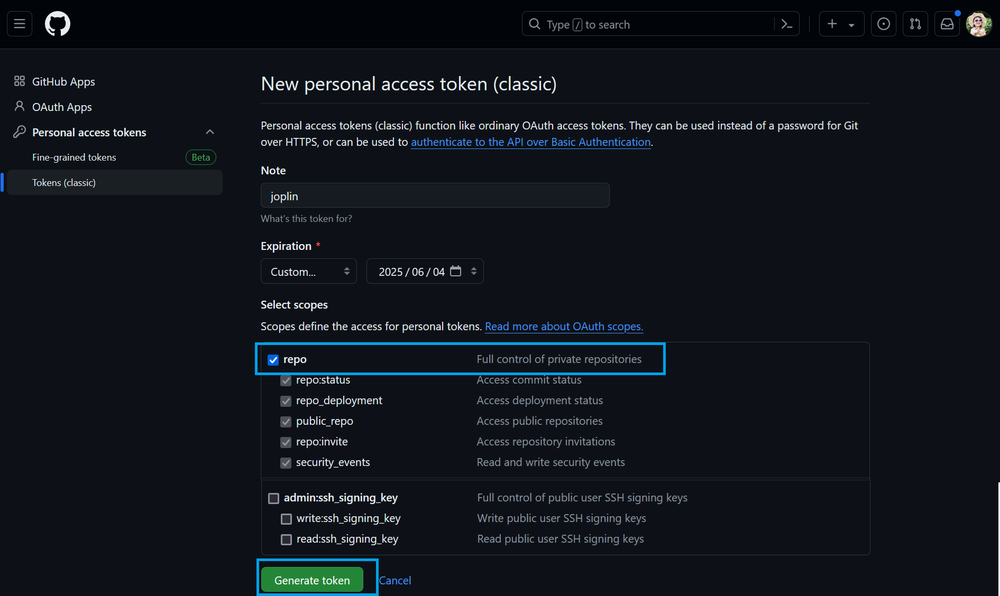
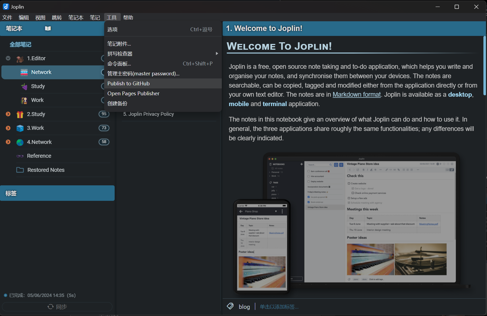
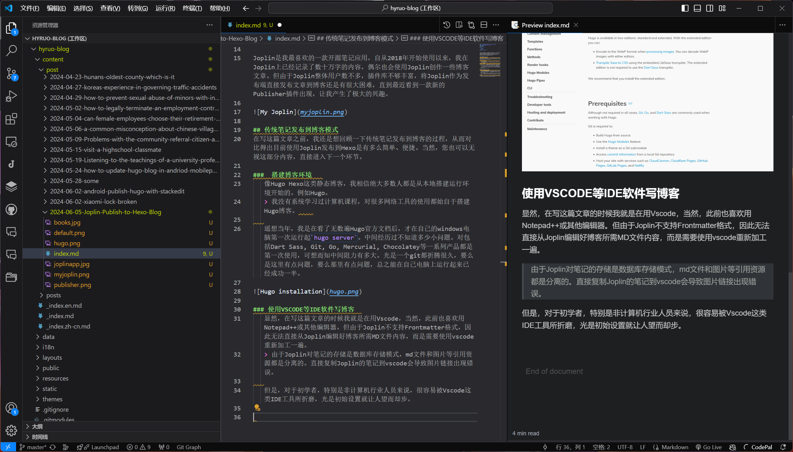
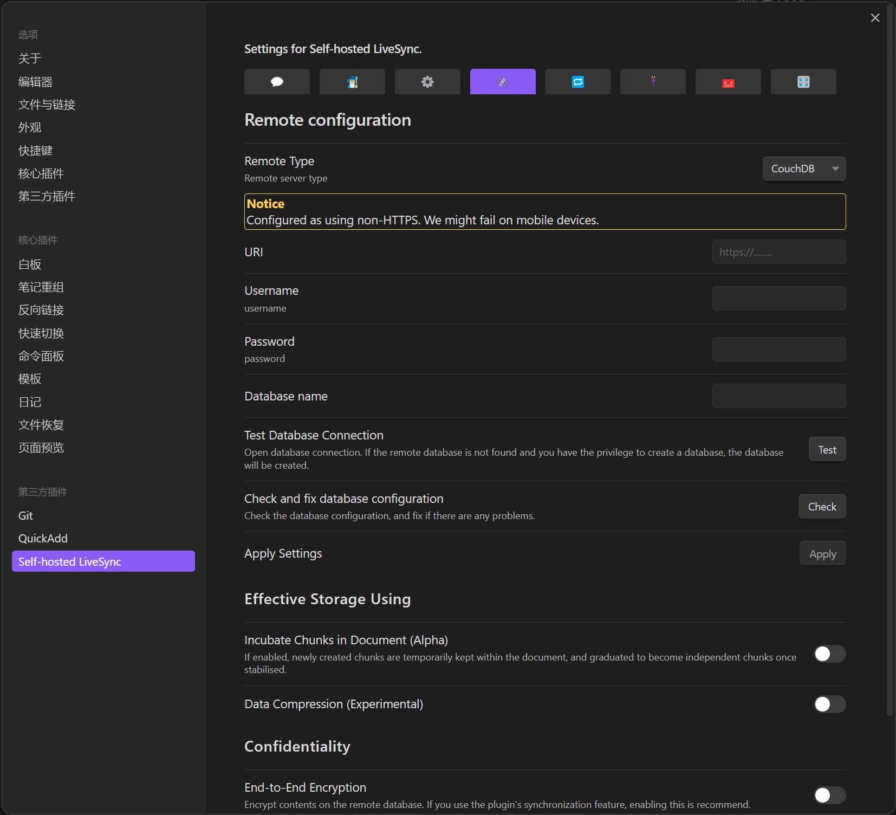
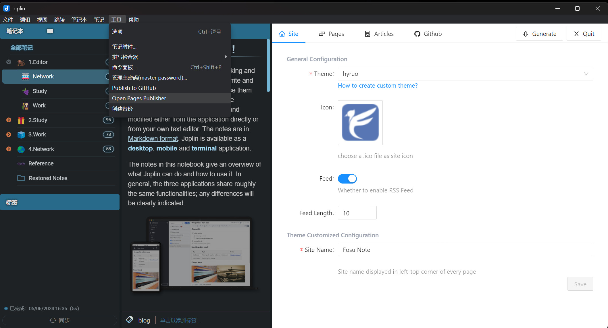
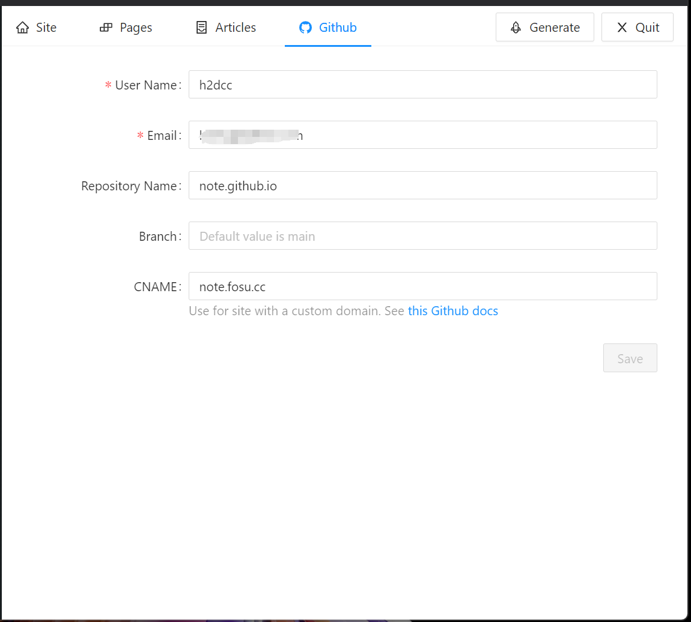
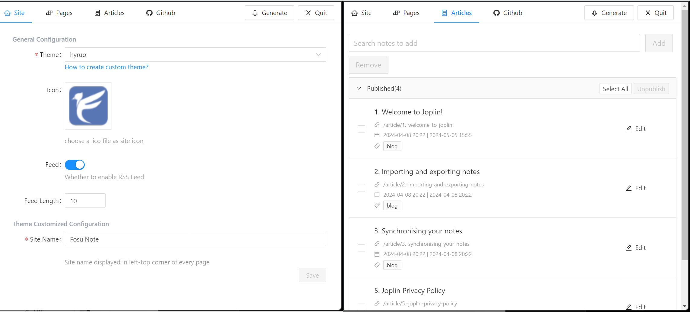
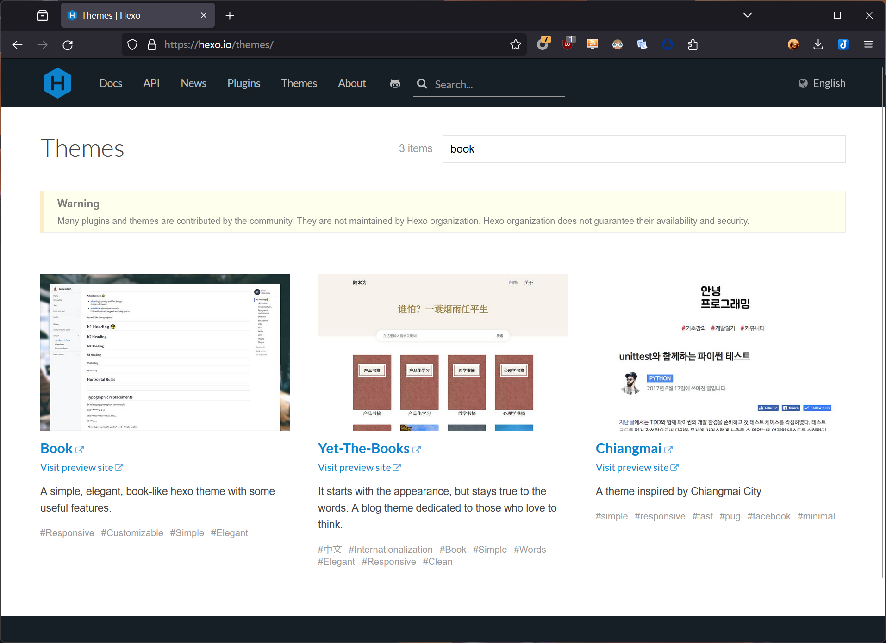

Joplin 是我最喜欢的一款开源笔记应用，自从 2018 年开始使用以来，我在 Joplin 上已经记录了数十万字的内容，偶尔也会使用 Joplin 创作一些博客文章。但由于 Joplin 插件库不够丰富，将 Joplin 作为发布端直接发布文章到博客一直有困难，直到最近看到开发者 [rxliuli](https://blog.rxliuli.com/) 发布的一款新的 Publisher 插件，让我产生了极大的兴趣，故此写下这个教程。也可以直接查看作者的 [插件文档](https://joplin-utils.rxliuli.com/en-US/joplin-publisher/) ，效果是一样的。

这么多年来，我很少写网络应用教程，但这次实在出乎意料。我认为此种方式是当下最为便捷和可视化的静态博客应用方案，具有多个显著区别于其他方案的优点：

1. **极速的“零代码”部署静态博客**（ Joplin Publisher 插件)
2. **极其出色的 Markdown 编辑器**（ Joplin APP )
3. **极简方式提交静态博客更新**（ Joplin Publisher 插件)
4. **无需代码知识，无需 VS Code， 无需 Git。** （搭建博客网站后，全程在 Joplin 中操作）

> 一个小插曲是，当我在 Joplin 社区论坛看到作者 [发帖](https://discourse.joplinapp.org/t/introduce-the-plugin-joplin-publisher/38383/9) 时，我参照文档操作，结果发现作者在仓库中漏传了 `_config.fluid.yml` 文件，看到帖子后才添加上。之后经我多次测试，暂未发现其他问题。


<br>

---

## 使用 Joplin 创建和发布 Hexo 博客的流程（熟手版）

使用 Joplin 创建和发布 Hexo 博客极为简单，只需要三个步骤：

1. 在 Github 上 Fork [Joplin Blog Template](https://github.com/joplin-utils/joplin-blog-template) 仓库，此仓库已自带 Hexo 自动部署和 Fluid 主题。
2. 在 Joplin 安装 [Publisher插件](https://github.com/rxliuli/joplin-utils/releases/download/joplin-publisher%401.0.0/joplin-publisher.jpl)，绑定 Github Token。
3. 在 Joplin 笔记上添加 `Blog` 标签，然后点击 Publish to Github 即可。
 
[](https://www.fosu.cc)
<br>

> 对于已经使用过 Hexo Hugo 等静态博客的朋友来说，这就是使用 Joplin 创建和发布 Hexo 博客的全部流程。简单到不可思议，全程下来三分钟都不用，还包含 Github Action 的自动部署时间。

---

## 使用 Joplin 创建和发布 Hexo 博客的具体方法（新手版）

以下是新手用户教程，对于零基础用户来说，亦没有什么难度。过程中基本做到“零代码”，且无需使用 VS Code 和 Git 等工具。相信零基础用户可以在 20 分钟内完成。

### 第一步：安装 Joplin Publisher 插件

由于此插件刚发布，暂未收录在 Joplin 官方插件库。需要在 github 下载插件后选择本地文件安装，后续应该可以直接在官方插件库搜索安装。

下载页面：[Joplin Utils](https://github.com/rxliuli/joplin-utils/releases)
下载地址：[Joplin Publisher v1.0.0](https://github.com/rxliuli/joplin-utils/releases/download/joplin-publisher%401.0.0/joplin-publisher.jpl)


  
<br>

### 第二步：创建 Github 仓库

1. **准备账号**  
   如果没有 Github 账号，可以自行注册一个，跟一般网站注册没啥区别，很简单。登陆账号后打开 [Joplin Blog Template](https://github.com/joplin-utils/joplin-blog-template) 页面。选择 Use this template, Create a new repository.   


<br>

2. **创建仓库**  
   在创建仓库页面，填写 Repository name (仓库名称)，名称应以 `.github.io` 结尾，如果是第一次使用 Github page，建议直接填写 `username.github.io` 。 例如，我的用户名是 h2dcc ，则填写 `h2dcc.github.io` 。***此项设置非常重要，除非你要使用自定义域名，否则必须按该格式填写***


<br>

3. **修改仓库设置**
   打开仓库后，在 Setting 中选择左侧 Pages ，将 `Build and deployment` 修改为 `Github actions` 。

   


<br>

  稍等几秒钟，刷新页面，此时可以看到博客的对外访问链接。
  
> 如果在 **创建仓库** 中，使用的是与 Github 用户名相同的地址，这里显示的就是该地址。例如，我的用户名是 h2dcc，如果在第二步我填下的是 `h2dcc.github.io` ，那么这里的访问地址就是 `h2dcc.github.cc` 。如果填写其他名称，则会生成一个更长的链接。*但这种长链接在使用 Joplin 插件发布到 Hexo 时会出现页面循环错误，除非将其更改为自定义域名。例如上图，我已经设置了 www.fosu.cc 作为自定义域名。*


<br>

### 第三步：在 Joplin 发布博客文章

1. **在 Github 获取密钥**
   打开 [https://github.com/settings/tokens/new](https://github.com/settings/tokens/new) ，点击 `Genarate new token` 随便输个好记的名字，设置使用时长，然后勾选第一个 `repo`  拉到页面下方 Genarate token ，然后在跳转后的页面复制Token即可。

> 该页面位置一般打开方式为：在 Github 上，点击自己头像，依次进入 Settings - Developer settings - Tokens Classic。


  
<br>


<br>
*注意：该密钥只会在刚生成时展示这一次，如果错过了，得重新生成一个。*
<br>

2. **在 Joplin 填写 Github 验证密钥**  
将上一步获取的密钥，连同 Github 用户名， Github 仓库名称填入，这里的仓库名称就是在上边 `第二步` 中 `创建仓库` 的名称。  


<br>

3. **在Joplin笔记中发布博客到Hexo**  
在需要发布到Hexo的笔记上添加一个 `Blog` 标签，然后点击 Joplin 的 `工具`- `Publish to Github`，稍等片刻即可通过上边第二步中的 `username.github.io` 页面显示网站内容。


  
<br> 


  
<br>


  
<br>

> 以上就是使用 Joplin 发布到 Hexo 静态博客的全部流程，至此一个静态博客的搭建和发布方式就构建好了。真正做到了全程“零代码”，无需使用 IDE 工具和 Git。

*对于网站配置等信息，我将放在本文最后一个部分。*

---

作为对比，下边我再啰嗦一下，简单总结传统笔记发布静态博客的过程。虽然跟本文主题无关，但可以对比看看 Joplin 发布到静态博客究竟有多么简单。

## 传统笔记发布到博客模式


###  1.搭建博客环境   
   像 Hugo Hexo 这类静态博客，我相信绝大多数人都是从本地搭建运行环境开始的。  

   > 我没有系统学习过计算机课程，对很多网络工具的使用都始自于搭建Hugo 博客。    
   
   遥想当年，我是在看了无数遍 Hugo 官方文档后，才在自己的 Windows 电脑第一次运行起 `hugo server` 。Dart Sass, Git, Go, Mercurial, Chocolatey 等一系列工具都是第一次使用，可想而知中间阻力有多大。光是一个 git 都折腾很久，要么是这里有点问题，要么那里有点问题，总之能在自己电脑上运行起来已经费尽心机。


<br>

### 2.使用 VS Code 等 IDE 软件写博客  
   显然，在写这篇文章的时候我就是在用 VS Code，此前也喜欢用 Notepad++ 或其他编辑器，另外我还写了一个关于如何在安卓手机上发布 Hugo 博客的教程 [如何在安卓手机发布 Hugo 博客](https://hyruo.com/tags/hugo/)。但由于 Joplin 不支持 Frontmatter 格式，之前无法直接从 Joplin 编辑好博客所需 MD 文件，而是得使用 VS Code 重新加工一遍。  

   > 由于 Joplin 对笔记的存储是数据库存储模式，md文件和图片等引用资源都是分离的。直接复制 Joplin 的笔记到 VS Code 会导致图片链接出现错误。  
   
   但是，对于初学者，特别是非计算机行业从业人员或爱好者来说，很容易被 VS Code 这类 IDE 工具所折磨，光是初始设置就让人望而却步。  



<br>


### 3.发布到 Github Gitee 等代码托管平台  
   静态博客文件一般都托管在 Github Gitee 等代码托管平台。但说实话，这些平台平常除了IT互联网行业比较熟悉，其他网民几乎都没直接接触过。对于如何使用 Git 提交文件一头雾水，而且还往往遇到网络不通等疑难问题。特别是今年初 Gitee（码云）直接停止了 Gitee pages 服务，导致在国内平台部署静态博客难度进一步升级。
   
   **将静态网站托管到 Github 一般有三种方式**

   1. 在本地生成静态网站文件，通过 Git 提交到 Github，直接使用静态部署。在文件较少时，这种是最直观的方式。此时 Github 仓库就如同一个虚拟主机一般，无需其他负担，只使用最简单的路由和文件功能。  
   
   2. 使用 Github Actions 在线生成静态网站文件。将静态网站的原代码上传到 Github，由 Github 自行编译静态文件并部署。就博客而言，这种方式每次只需要提交新的文章和图片即可，Github 会立即自动生成静态网页文件。  
   
   3. 使用 Vercel Cloudflare NetLify 等静态部署服务。主要是替代Github Actions，这些服务在监控到 Github 仓库文件变化时，会自动拉取更新生成静态网页。主要区别是在于网络速度方面问题。不过这都是玄学，有时候 Github Pages 比较快，有时候 Cloudlare pages 比较快，没有定数。例如，本博客此刻托管在 Vercel，经测试国内连接速度基本在1秒以内。  


<br>

---

## 使用 Obsidian 笔记软件发布到 Hugo 的方法

   上边这部分我简单介绍了一下使用 Hugo Hexo 静态博客的常规方法。作为对比，这里我再引用一下使用 Obsidian 发布 Hugo 等静态博客的方法。

   建议可以直接观看《胡说》博客中的以下三篇文章：
   1. [Hugo 博客写作最佳实践](https://blog.zhangyingwei.com/posts/2022m4d11h19m42s28/)
   2. [ Obsidian + Hugo 最佳配置推荐 ](https://blog.zhangyingwei.com/posts/2022m4d12h13m13s22/)
   3. [ 把 Obsidian 变为 Hugo 博客的集成管理平台 ](https://blog.zhangyingwei.com/posts/2024m1d30h10m7s52/)

  我在上个月曾经尝试过使用这个方法发布博客。但是该方法的一个缺陷是，必须首先在 Github 搭建有一个 Hugo 博客。其次，该方法需要依赖 Obsidian 上多个插件，而且过程中需要不断调试才能让各个插件之间配合生效，初始配置难度很大。

  事实上我放弃使用 Obsidian 来发布 Hugo 的最大原因是我并不喜欢使用 Obsidian，总觉得它的各种插件配置过于复杂，一个最简单的同步功能都得耗费很多精力去维护，不如 Joplin 来得方便。而且使用 Obsidian 发布Hugo 博客还需要由 Obsidian 来接管 Hugo 下的博客目录，将其单独创建一个仓库，在使用过程中还得在普通笔记仓库和博客文件仓库间来回切换，否则容易与 Git 数据库混淆产生冲突。



<br>

---

## 另一种通过 Joplin 发布到 Github Pages 静态博客的方法  

如果你眼尖可能在上边截图中看到，Joplin 有两款 Publisher 插件，除了上边介绍这款新插件，之前 Joplin 中已经有另一款 Pages Publisher 插件，这款插件我使用过半年时间。但这款插件并没有使用 Hexo Hugo 等静态博客程序，只是一个简单的 Html 静态网站生成器，适合极简主义者。


  
<br>

### 1.Github Token 配置
该插件配置同样极为简单，只需要填入 Github Token 即可开始使用。


  
<br>

### 2.Github 仓库配置

在 Github 存储仓库部分，填写 Github 用户名，注册 Github 所用邮箱， 仓库名等信息即可。（可以选填自定义域名，如已经在 Github Pages 设置自定义域名，则必填）


  
<br>

### 3.选择文章生成并发布

网站设置部分只需要填写网站名称、图标等简单信息，并搜索选择需要发布的笔记内容即可点击 `Generate` 在本地生成静态网站。可点击 Preview 在本地浏览器预览网页内容，点击 Publish 则将发布到 Github Pages.


  
<br>


  
<br>


  
<br>

### 4.更改主题

目前该插件除了默认主题外，只有一款用户自建主题。但与原主题几乎没什么区别。主题仓库为 [joplin-plugin-page-publisher-theme ](https://github.com/abbychau/joplin-plugin-page-publisher-theme) ，下载到本地的Joplin插件目录中替换原主题即可。

---

## Joplin 发布文章到 Hexo 后的一些网站配置问题

### 网站基本设定
在Github仓库中找到 `_config.fluid.yml` `_config.yml` 这两个文件。其中，`_config.fluid.yml` 是 Hexo 的 Fluid 主题配置文件；`_config.yml`是 Hexo 的默认配置文件，可以直接在 Github 代码区编辑这两个文件。


<br>

1. `_config.yml` 文件配置
一般只需要配置该文件前半部分即可，后半部分可以参考 [ Hexo 官方文档](https://hexo.io/zh-cn/docs/configuration) 进行配置。  


<br>
例如，我只修改了这部分内容，其中每个 `:` 后都应保留空格。
```
title: 佛苏笔记
subtitle: '好好学习 天天向上'
description: '法学法律工作笔记以及对IT互联网行业的观察笔记'
keywords: 法学,佛苏,fosu,笔记,joplin,博客
author: Hyruo
language: zh-CN
timezone: 'Asia/Shanghai'
url: https://www.fosu.cc
```
<br>

2. `_config.fluid.yml` 文件配置
该文件可配置项目较多，具体可参考[ Fluid 主题文档](https://fluid-dev.github.io/hexo-fluid-docs/guide/)进行配置，或者直接参照文件内注释进行配置。由于这款主题并不适合我使用，所以我只简单配置了一下网站标题，但不得不说 Fluid 这款主题真的是极其用心，很少能见到配置注释这么完整的主题了。

```
navbar:
  # 导航栏左侧的标题，为空则按 hexo config 中 `title` 显示
  # The title on the left side of the navigation bar. If empty, it is based on `title` in hexo config
  blog_title: "佛苏笔记"
```

<br>

### 更换其他主题（需要使用到git)
由于我已经有了本博客，所以并不需再建设一个完全博客风格的网站。我的想法是，借助我的 Joplin 笔记软件，将自己的一些读书笔记发出来，这样的话，使用 Fluid 主题就不是很合适了。如果你没有这方面需求，可以无视这部分，并且更换主题貌似只能使用git，除非将主题文件通过网页逐个上传。

1. **在 [ Hexo 官网](https://hexo.io/themes/) 查找你想要的主题**  



<br>
例如，我根据自己喜好查找到这个 Yet-The-Books 主题比较符合自己的要求。然后点击链接进入主题在 Github 上的仓库，fork到自己仓库。

2. **克隆 Hexo 仓库到本地**
  
   ```bash
   git clone https://github.com/username/username.github.io.git
   cd username.github.io
   ```

3. **添加主题仓库为子模块**:
   在你的 Hexo 博客仓库中，添加你刚刚 Fork 的主题仓库作为子模块。

   ```bash
   git submodule add https://github.com/username/yet-the-books.git themes/hexo-theme-books
   ```

   这里，`yet-the-books` 是你 fork 的主题仓库的名称，`hexo-theme-books` 是你想要在 Hexo 中使用的主题名称。

4. **提交并推送更改**:
   提交子模块的添加，并推送到你的 GitHub 仓库。

   ```bash
   git add .
   git commit -m "Add theme submodule"
   git push origin main
   ```

   请确保将 `main` 替换为你的默认分支名称，如果你的默认分支不是 `main`。  


5. **更新 Hexo 配置**:
   在你的 Hexo 配置文件 `_config.yml` 中，设置主题为你刚刚添加的子模块。

   ```yaml
   theme: hexo-theme-books
   ```

6. **删除与默认主题 fluid 有关的部署文件**
   - 在根目录下删除 `_config.fluid.yml` 文件
   - 在 theme 文件夹中删除 `.gitkeep` 文件；
   - 在 hexo 仓库中搜索关键词 fluid ，删除 `package.json` `pnpm-lock.yaml` 两个文件中有关fluid部署依赖文件部分代码。


[](https://books.fosu.cc) 
<br>

### 给博客绑定自定义域名  

1. **注册一个域名**
   注册域名教程可以在网上搜索。由于本文所述 Joplin 发布到 Hexo 的教程，依托 Github 部署，推荐使用国外的域名注册商，比如 Namesilo Godaddy 等传统域名服务商。具体方法请自行查阅相关教程。

2. **设置域名 DNS 记录**
   在将域名绑定到 Github Pages 时，需要将域名设置 A 记录到 Github 的 IP，或者设置 CNAME 到 `username.github.io` ，这里的 `username` 依然是你自己的 Github 用户名。考虑到国内访问的稳定性，推荐使用 CNAME 方式。

3. **在 Github 上绑定域名**
   即上文中修改仓库设置部分，在下图中 Custom domain 中填入你需要绑定的域名。如果 DNS 记录已经设置成功，在此页面稍等片刻即可绑定成功。 刷新页面，在该页面上方 Github Pages 位置，你应该能看到域名已经成功设置的信息。  


<br>
#### Cloudflare SSL 与 Github Pages Enforce HTTPS 的设置问题 
很多使用 Cloudflare 的用户都会遇到这个问题，就是在 Cloudflare 托管的域名，在开启 SSL 完全（严格）模式后绑定到 Github Pages 会出现 SSL 证书冲突。这里提供一个取巧的解决办法。

1. 在 Cloudflare 设置 DNS 解析到 Github 时，关闭 `小黄云`。
2. 在 Cloudflare 设置 DNS 解析到 Github 时，将 `SSL/TLS 加密模式` 修改为 `灵活`。
3. 在 Github Pages 上删除绑定域名，重新添加。刷新页面直到 Enforce HTTPS 选项由灰色变为可勾选为止。如果不行，重新删除添加一遍，一般一两分钟都能搞定。
4. 在 Github Pages 上的 Enforce HTTPS 启用后，到 Cloudflare 面板重新开启 `小黄云`，并将 `SSL/TLS 加密模式` 重新修改为 `完全（严格）` 。

至此，网站证书将成功转为 Cloudflare 默认由 Google 提供的 SSL 证书，同时从 Github Pages - Cloudflare - 访问者之间的流量全部由 Cloudflare 进行加密。

---


最后，再次感谢两个插件的作者 rxliuli 和 ylc395 , 感谢Joplin Hexo Hugo 社区的众多开发者。世界有你们而变得更美好！