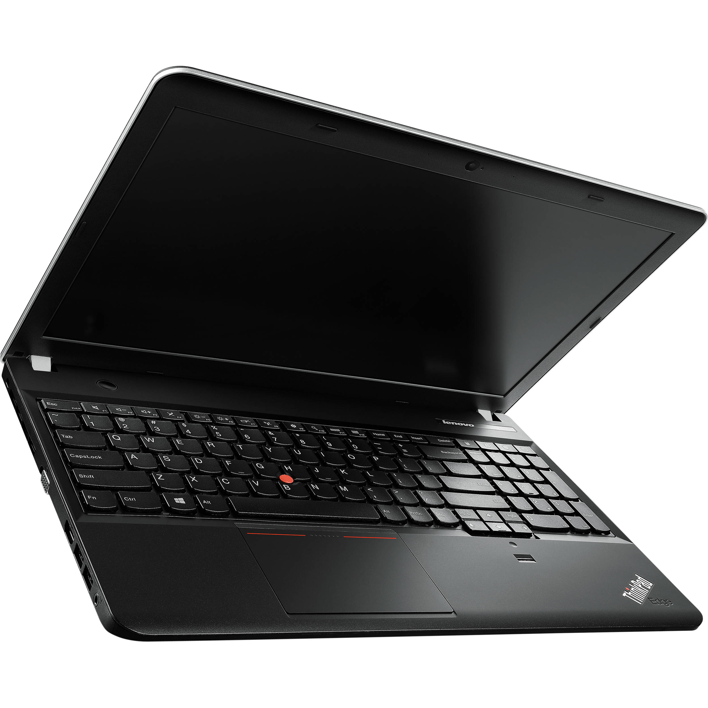

2008 年以来，我购买过接近 10 款电脑，其中大多数是笔记本电脑，尤以 ThinkPad 居多，此外也组装过两台 DIY 电脑。

## 个人电脑使用历史

### DIY电脑

1. **第一次 DIY 电脑**

> 2008 年初，拿着父母支持的经费，我在佛山鸿运电脑城入手了第一台 DIY 电脑，依稀记得大概配置如下。

CPU: AMD Athlon 3000+  
内存: 1GB DDR2 800 Mhz x2  
主板：Foxcoon 不记得型号主板  
显卡：七彩虹 ATI Radeon 2400xt 256MB  
机箱电源： 神舟大水牛牌子的  
显示器：Sony 17' 特丽珑 CRT （二手），后期更换 BenQ 19' LCD  

这台电脑陪了我三年大学时光，使用它玩了几千个小时的 CS 1.6 和 CS:S，尤其是配合一开始花 150 块钱买的二手 Sony CRT 显示器，配合 800x600 的游戏分辨率（最大分辨率 1600x1200），简直是神挡杀神佛挡杀佛，AK-47 爆头一枪一个准，AWP 拉枪爽到飞起。 使用它，我也建设了自己第一个博客网站。

这台电脑的主要缺点是 AMD 的这款 CPU 实在是“火龙”，在那学生宿舍还普遍没有空调的年代，夏天 CPU 温度经常飙到 120 度以上而过热死机，平常不得不打开电脑机箱侧面板，专门用一个大电风扇对着吹才能勉强将机箱内温度压下去。但学生宿舍的面积太小，8 个人一间的宿舍内，个人能拥有的书桌不过1米多一点长度，很难同时摆得下机箱、CRT显示器、鼠标键盘以及一个电风扇，为此经常得以一个奇怪的姿势去使用电脑，煞是艰苦。更多时候选择白天睡觉，晚上玩游戏，毕竟晚上的气温稍微低点，CPU 没那么容易烧到死机。

后来这台电脑在我工作变动过程中，留在出租房没要了。

2. **第二台 DIY 电脑**

> 2013 年，我组装了另一台 DIY 电脑，这台电脑的配件都是在京东购买的，因此现在还能查找到配置记录。

配这台电脑的唯一目的也是为了玩 CS:GO ，由于 CS:GO 对电脑性能要求并不高，因此选了入门 CPU 和 普通显卡。但这款显卡似乎有点问题，我在一个月后将其退货换了另一款 MSI 的 R7850 显卡，并在两年后进一步升级为了铭瑄的 Nvidia GTX 960，以及 650W 电源。期间更换了一款 DELL U2412M 24' 显示器，并将 CPU 更换为了 Intel Xeon E-1230V2。

这台电脑在使用过程中多次出现故障，一开始是显卡故障，后来是主板故障。特别是这块 GigaByte 的主板，由于主板芯片组原生不支持 USB3.0，因此主板主动加戏额外弄了个芯片来支持 USB3.0, 但很不稳定，最后因为 BIOS 芯片烧毁，导致整个主板报废。*[之前博客有记录这个事：技嘉H61主板](https://hyruo.com/article/2016-08-05-gigabyte/)*  此后我好不容易才买到款二手昂达 H61P 主板（此时已经没有新的 H61 主板可买）。

这台电脑在 2017 年后被我使用 M-ATX 机箱改造成 HTPC 搭配家里的 Sony 65' 电视机使用，但使用时间不长，之后一直闲置，显卡也被挪作它用。

---

### ThinkPad 笔记本电脑

1. **ThinkPad T61P**

> 2010 年底，我购买了第一台笔记本电脑，二手的 ThinkPad T61p，主要是考虑到价格便宜，而且准备去 IT 互联网公司上班，所有同事都是用 ThinkPad，就随波逐流买一个二手撑撑场面。

T61P 是我使用 ThinkPad 的起点，该电脑沉稳的设计风格，皮实耐操的机身框架，内部高度可替换的接口设计，以及经典键盘和 TrackPoint 都给我留下深刻的印象。但是因为被我拆卸次数太多，在某次拆卸过程中，不慎造成主板损毁，之后在我使用 ThinkPad R60 主板（与 T61P 主板基本一致）对其进行替换，但因为 1394 接口上的稍许不同，新主板运行并不稳定。大学毕业后，这台电脑一直“躺尸”在湖南老家，几年后曾开机过一次，但因为性能已经跟不上时代，其使用寿命就此结束。

从 ThinkPad T61P 起，之后我陆续买了很多个 ThinkPad 笔记本。

2. **ThinkPad X220**

我使用时间最长的电脑是 2012 年购买的 ThinkPad x220 。这台电脑本来预装的 Windows 7 系统，但当年 Windows 8 发布，仍然可以直接升级，之后一直升级到 Windows 10. 由于该电脑在安全芯片方面缺失，最终遗憾停留在 Windows 10，无法升级到 Windows 11. 该电脑购入后，我自行升级了 Msata 接口的固态硬盘，型号是威刚 SX600，由于电脑只有 SATA 2.0 接口速率，所以该硬盘只能工作在 3Gb/s ，实际最高读写在 270MB/s 左右，与时下 Nvme 普遍在 3000MB/s 以上的速率不可同日而语，但也比原本 2.5' HDD 普遍在 70MB/s 左右的速度强了很多倍。另外我还将一个 PCIE 接口升级成两个 USB3.0 接口，使得该电脑在日常设备传输速度方便有了较大提升。即便它的 CPU 核心只是一枚 Intel i3-2350M ，但截至 2024 年的当下，使用它浏览网页，播放 1080P 视频或者文档操作仍然不会感觉有什么卡顿。

这台电脑目前仍在我家外接一个 24 寸显示器，但已经很久没开过机。

3. **ThinkPad E531**

2015 年初，我在京东商城买了一台 ThinkPad E531 给我老婆使用，但由于塑料外壳以及15寸屏幕略大等原因，她并不是很喜欢这个，特别是在一个女性扎堆的外资企业部门，用这个设计风格的电脑显得有点格格不入，当年底便在闲鱼转卖了。

4. **ThinkPad T450**

卖掉 ThinkPad E351 后，我仍然不死心，继续头铁地给老婆买了台 ThinkPad T450。可惜的是，她没过多久便不再需要自带电脑上班，之后我自己使用了一阵，但由于这款电脑屏幕反光原因导致我用得也不是很习惯，加之日常使用与 X220 重复，不久就被我卖给 QQ 群好友。

5. **ThinkPad P53**

2019 年，我购买了一台 ThinkPad P53 笔记本，该电脑仍是我目前家庭使用的主力设备。其搭载 Intel i7-9750H 处理器，以及 Nvidia Quadro T2000 显卡，我为其配备了 64GB DDR4 2400Mhz 内存，还为其安装了 3 块固态硬盘，其中 2 块 M.2 接口各 1TB 的硬盘和 1 块 2TB SATA3.0 接口的硬盘。加上后续家里增添了 3 台显示器，其中 BenQ PD2700U 4K 显示器和小米 34 寸 2K 显示器都是使用 ThinkPad ThunderBolt 3 扩展坞接入 ThinkPad P53，驱动这个机器总共需要 230W + 65W 两个电源，合计 300W 的最高功耗。总计算下来，我在这台电脑上投入接近 3 万元人民币，虽然这个配置在当下看起来有点平庸，但如果只考虑运行的稳定性、可靠性以及家庭需求而言，我觉得这台机器起码还能继续使用 5-10 年时间。

---

### 其他电脑

> 在ThinkPad以外，我间歇性买过几款电脑，但要么是使用时长比较短，要么是用途特殊。

1. **Dell Precision**

2016 年，我购买了两台 Dell Precision 笔记本，一台型号是 M4600 另一台型号是 M6800，都是二手的。

之所买这两台笔记本，主要是它们都搭配有 TrackPoint 指点杆，而这也是 ThinkPad 的标志性设计。事实上 Dell 之所以在其高端工作站上使用这一设计，也是得到了 ThinkPad 授权，方便其更好服务有 TrackPoint 使用习惯的传统商业用户。其中，M6800 当时被我改造升级了 GTX 970M 显卡，但该次改造不是很成功，因为 BIOS 支持不完善以及驱动方面原因，会出现长时间玩游戏时蓝屏现象。 

后来，M6800 又被我卖回去给了二手笔记本卖家。 另一台 M4600 借给了我堂弟使用，直到它变成一条“尸体”后才被还回来。我认真修复了一下这台设备，包括笔记本 CMOS 电池失效，键盘按键失效，开关机按钮损坏，以及蓝牙模块被烧毁等问题，如今它还是能够被成功启动，但是因为多次拆卸导致部分卡扣断裂，整体磨损厉害，以及开机过程必须通过手工选择启动盘进入等原因，我已经好很长时间没启动过它了。得益于 Intel i7-2840QM 处理器，该电脑实际运行速度比 ThinkPad X220 要强很多，只是因为 Windows 11 所要求的安全芯片问题导致亦无法升级新系统。

2. **Intel NUC**

2021 年，我购入了一台 Intel NUC 11 迷你电脑，该电脑搭载 Intel i5-1135G7 处理器，我为其配备了 16G DDR4 3200MHz 内存，1 块 1TB 的 M.2 固态硬盘和一个 2.5' 2TB HDD 硬盘。一开始主要用作家庭备用机，即在我和家人需要同时使用电脑时的一个备用设备。后来，受一些非正常因素影响，我将其用作了其他特殊用途。

---

## 本次购买电脑情况

> 由于目前家里仅有一台 ThinkPad P53 堪当大任，而 ThinkPad x220 以及 Dell M4600 我已经没有太多使用兴趣，所以就缺少了一台备用设备。于是，最近开始谋划购买一款新的电脑。

### 基本需求

基于备用机性质，我并不需要这台电脑具有很强的性能，只需要满足日常浏览器使用，VS CODE， Linux 虚拟机以及必要文档办公软件使用即可。这个需求实际上任何 2018 年之后生产的主流电脑都可以很好地满足。一开始我将目光继续锁定在二手 ThinkPad X 系列笔记本。 毕竟二手产品的性价比，真是毫无悬念，高得离谱。可惜，在看了多款 ThinkPad x1c 二手笔记本后，发现溢价还是有点高，于是将目标下放到 ThinkPad x13 系列，很快就在京东上找到一款 2023 年生产的 ThinkPad x13 Gen4 二手笔记本，搭载 AMD R5 5650U CPU，只需要 2900 元人民币。没多想，我就下单了。但奇怪的是，我在下单前曾问商家啥时候发货，其回答说第二天就发。结果过了 3 天都还没发货，然后我再询问时，他们回复还得再等 3 天。感觉有点不对劲，又说不上来。然后在淘宝找了找同款笔记本价格，发现都在 3500 元以上，心想这该不会是有坑吧。于是趁着没发货就赶紧取消订单。

接着，就刚好看到微信群有人发小米笔记本的促销信息，然后发现小米的 Redmi Book 14 新机也是卖 2900 元，简单查看了一下电脑参数后，便下单。 目前已经使用了4天时间。

---

### Redmi Book 14

总体来说，我对小米这款笔记本还是满意的。主要有以下优点：

1. **外观时尚**

也许是我用了很多年 ThinkPad 的缘故，对黑色商务风早就习惯了，每当看到其他样式的笔记本，都感觉有抵触心理，觉得不够稳重。但真到自己买了这款银色金属外壳的笔记本后，又感觉这设计确实还不错。简单大方，不沾指纹，还是很耐看的。我这几天上课一直带着它在教室使用，感觉不会很突兀。

2. **机身轻薄**

之所以在之前想购买 ThinkPad X 系列，主要还是希望购买一款轻薄笔记本，方便移动使用。像家里的 ThinkPad P53，机器本身就有 3 公斤，加上 230W 的大电源，总重量起码在 4KG 以上，即便在家里挪个房间使用都觉得很麻烦，带出门使用更是得下个很大的决心才行。这款 Redmi Book 14 虽然没有 ThinkPad x1c 或 x13 Gen 4 那样轻薄（低于 1.1-1.3KG），但 1.37KG 的重量，已经让我喜出望外了，拿在手里确实不感觉重，放在背包也很轻便，我甚至感觉这个笔记本还没有 ThinkPad P53 的 230W 电源重。附送的 100W 氮化镓充电器，以及我自行购买的 Anker 65W 氮化镓充电器重量都控制得不错，前者相当于 1.5 个 Vivo 100 Pro 原装充电器，后者甚至比 Vivo 原装 120W 充电器还要轻一半。

  

3. **屏幕素质好**

这个屏幕素质是相对于 ThinkPad 而言的，毕竟 ThinkPad 的屏幕一直都是一言难尽的东西，除非上顶级图形工作站，否则我不觉得一般的 ThinkPad 能有这么好的显示效果。例如，ThinkPad x13 几乎都是 1080P 60Hz 的显示屏，而小米这款 Redmi Book 14 使用的是 2880x1800 分辨率 120Hz 的显示屏。

4. **充足的性能**

我购买的这款 Redmi Book 14 使用的是上一代的 Intel 处理器 i5-12500H。我理解小米之所以这样配置，显然是为了极致的性价比。毕竟使用一款“过时”的 CPU 所带来的价格优势，是“减配”笔记本上其他配件所难以比拟的。事实上就是因为 CPU 采取了上一代的产品，才确保了整机在如此低廉价格的情况下，其他配件没有被“减配”。例如，它提供了指纹开关、1080P 摄像头、NFC 芯片、4 颗麦克风阵列、键盘背光、WIFI 6、Dolby 认证扬声器等等。至于说到这个 Intel i5-12500H 芯片，也完全能够满足我的使用要求，毕竟这款芯片性能已经比我 NUC 上的 i5-1135G7 高出近一倍，比我 ThinkPad P53 上的 i7-9750H 高出近 70% ，而后两者在我日常使用过程中，从未在 CPU 性能上拉过后腿。

> 这里还有个需要吐槽的点，我在 Dell M4600 以及 ThinkPad P53 等机器上使用指纹解锁时，时常遇到解锁失败的情形，弄得我多数时候只能选择 PIN 码输入解锁。但从小米这款笔记本的使用来看，这个集成在开关机键上的指纹锁真是如同手机指纹锁一般准确便捷。

5. **堪用的电池**

这些天我在西北政法大学参加培训，每天上下午都是 3 个小时的上课时间，我全程使用 Redmi Book 14 记录课题笔记以及查找资料，每 3 个小时下来，从 100% 电量下降到 45% - 35% 不等。换言之，这个笔记本 56WH 的电池大约能连续使用 4 个小时或更多点的时间。上午使用完后，中午在酒店充 1 个小时左右又能满电。

6. **多设备互联**

由于我没有购买过任何小米品牌手机，所以我没机会尝试手机与电脑便捷的互联功能，包括手机 NFC 一键流转照片或正在观看的视频到笔记本。但我也试用了一下小米自带的一些应用，像一键调用小米 AI 小爱同学，感觉还是挺新鲜的，还有个会议语言转录功能，还带自动翻译，看起来应该很不错。但对于我来说，这些都是可有可无的功能，毕竟我试用了一下这些软件后，就将自带的 Windows 11 家庭版卸载，更换为 Windows 11 专业版。可惜的是，如果不安装小米自带的应用，那键盘上小爱同学专属按钮就只能闲置了。至于其他 FN 功能键，实际上 Windows 11 自带那些快捷键功能。

---

### 购买 Redmi Book 14 后的一点遗憾

> 由于长期使用 ThinkPad 的惯性，我对小米 Redmi Book 14 最难以适应的问题依然是 TrackPoint 指点杆的缺失。指点杆真是一个用久了就回不去的设备，可以让双手始终保持在键盘区域，无需来回移动，而且指点杆搭配按键区域的设计，让大拇指可以肩负鼠标左中右按键的角色，很方便就可以实现各种拖动操作。但这些操作一放到触控板就很多问题了。

- 首先是容易误触，在手移动的过程中很容易误触到触控板导致光标移动。在 ThinkPad 上我通常是一拿到机器就把触控板关闭，但在这台小米笔记本上，作为唯一的指示操作设备，显得很无奈。
- 其次是选中操作困难。例如，想在 VS CODE 或网页中选择某几段文字复制下来，在触控板上需要先双击再迅速拖动，我这几天在尽量适应这个操作以提高准确率。
- 再次是拖动操作困难。例如，想拖动一个窗口进行适当缩小，我一般会先缩放然后鼠标指针选中右上角进行拖动缩小操作，但在触控板上由于需要先双击边框，很容易误操作导致窗口直接关闭。还有一种错误率很高的操作是在浏览器 Tab 栏中，经常在点击某 Tab 栏想查看内容时被误操作将该 Tab 栏直接拖出浏览器窗口成为一个单独的新 Tab. 
- 最后是触摸板与其他习惯的冲突。例如，在我的 Vivo 手机上，手指在屏幕从右边缘往内拖动是“返回”，但在触控板上双指从右往左是“前进”，从左往右才是“后退”。又例如，指点杆是所见所得操作，手指往哪个方向用力，光标就往哪个方向移动，包括屏幕内滚动也是如此。但在触控板中，滚动操作却是反方向的，双指向上滑动是将内容往下拉，双指向下滑动才是将内容往上拉。但好在这种设置都是可以进行修改来适应自己原本习惯的。只是在使用初期还有很多需要适应的地方。

