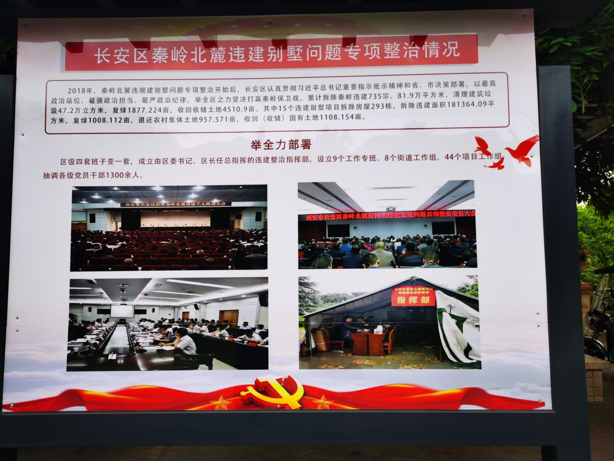
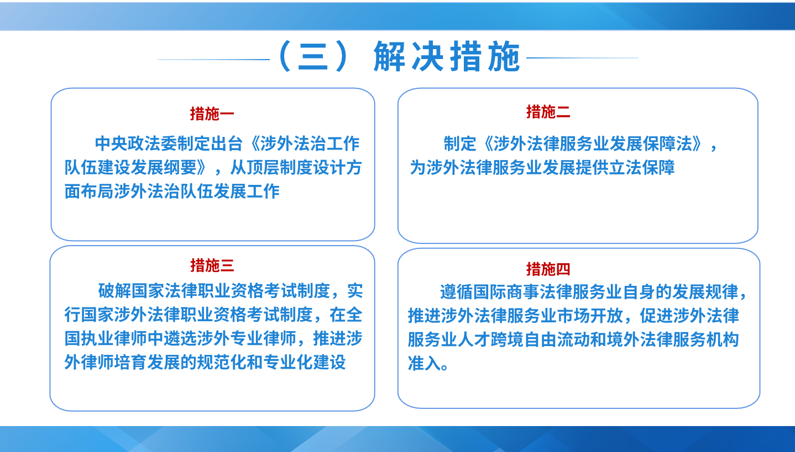
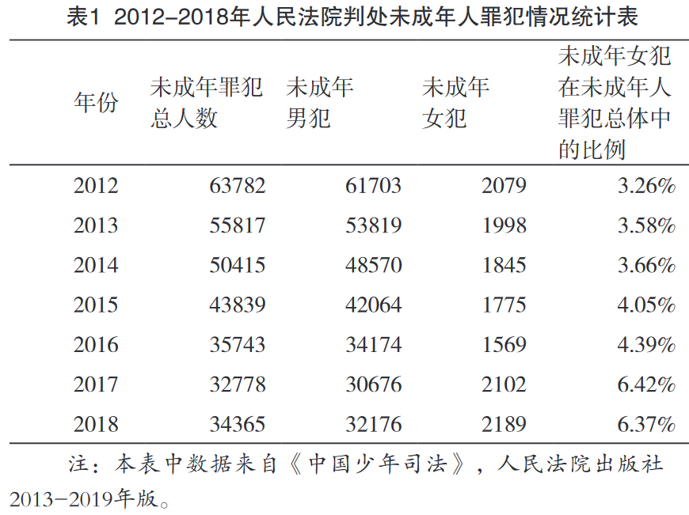
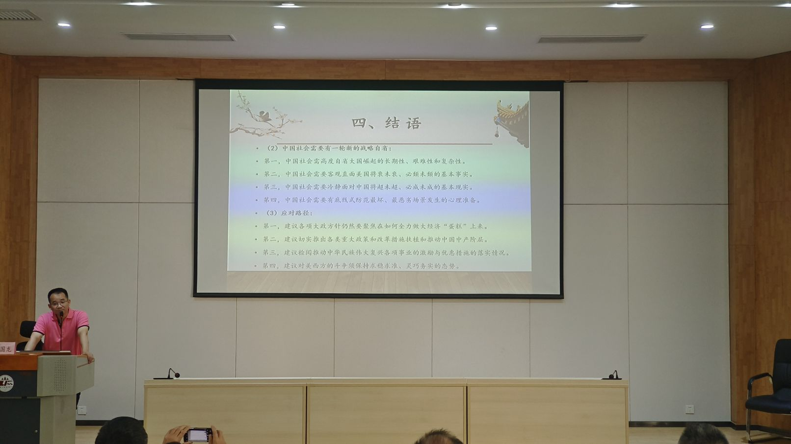

6月11-16日，有幸参加广东省法学会组织的业务能力培训班，地点在西北政法大学雁塔校区，位于陕西省西安市。虽然时间只有短短一周，但紧凑的学习课程和课后的行程经历，都给我留下深刻的印象。

## 培训课程及思考

### 两会精神和要点解读
授课老师分别从陕西、广东角度对两会精神进行解读，特别是对前些年发生的“秦岭别墅”事件进行深入剖析，由于内容较为敏感，这里也就不再复述。
课后，来自东莞的同学还专门约大家去“秦岭别墅”事件现场观看。 但由于事情已经过去好几年了，原来的别墅违建现场，早已建成为“秦岭和谐森林公园”。

### 枫桥经验与社会治理创新

授课老师是枫桥经验研究和社会治理研究方面的专家，并围绕此主题出版过多本学术专著。授课过程中，有我最感兴趣的两个方面内容： 

1. 关于社区居委会和村民委员会的定位区别问题。主要涉及到社会治理过程中，村委会与居委会在职能、运转模式和参与方式等方面的差异问题。
2. 关于耕地占补平衡过程中的实施程序问题。主要涉及农村宅基地转换为耕地以及耕地指标在区域间流转过程中的一些程序疑惑。

### 延安精神及其当代价值

授课老师对延安革命史了然于胸信手拈来，过程中印象最深的是“西安双十二事变”以及“重庆谈判”的一些细节问题。为此，学校课后还专门安排了到西安事变纪念馆进行参观学习。

### 全面对外开放新格局与我国涉外法治建设的新布局

授课老师是国内国际私法方面的专家，曾跟随外交部参与国际私法协议磋商谈判。这门课，让我对近年来非常热门的涉外法治工作有了系统的、全新的了解。整体来说，国内涉外法治工作仍处于起步阶段，需要补的课非常之多，与经济政治地位严重不相匹配。这个领域，未来几十年都会成为法学学科中的绝对热门。

比如说，当讲到国内法治人才匮乏时，老师引用数据，在全国70万律师中，能够从事涉外法律实务的律师不足1万人，能够在境外参与诉讼、仲裁庭审的律师不足300人，能够在WTO等国际组织争议解决机构中提供国际法律服务的律师不足30人。在涉外法治规则和体系构建方面，目前我国在进出口贸易中选用外国法的比例占到95%以上，在国外开庭或仲裁的败诉率高达95%以上，国内涉外机构处理的案件95%以上都是内地加港澳台的案件。在联合国机构中，来自中国的公务员比例不足中国缴纳会费比例的1/15，其中从事法律事务的几乎为零，在国际法律规则构建方面，国内几乎没有参与权和话语权。

最后，这位老师也提出了几个非常具有针对性的措施，如果能被采纳，久久为功后，应该还是会部分缓解这个问题。

### 当前未成年人犯罪现状与对策

未成年人犯罪问题一直是我这几年关注的重点之一。在本次课上，我最关注的是授课老师提出的女性未成年人犯罪问题，之前确实接触不多。也趁着这次学习计划，进一步了解这方面情况。

总体来说，未成年女性犯罪的数量较少，但绝对数量和相对比例均呈现逐年上升的趋势，犯罪后果趋于严重，还是需要引起重视的。

#### 未成年女性犯罪的特点

1. 犯罪类型多样化、手段暴力化，且带有女性自身的特点；  
2. 共同犯罪居多，刑期以短期刑为主；  
3.  以情境性和冲动性犯罪为主；  
4.  被害人多为女性等。  
  
#### 未成年女性犯罪的心理原因

1. 在信息加工方面，关注内容低俗，学业表现不佳；    
3. 在行为调节和控制方面，犯罪动机以谋财为主，负性情绪较多，需要层次不高，价值观不正；  
4. 在心理特性方面，情绪智力低，人格不健全。在心理健康方面，在犯罪前往往长期承受巨大压力；  
5. 犯罪前常空虚无聊，多出现偏差行为；多存在心理创伤。相关部门应当据此有针对性地开展预防与教育改造工作。  

  

*焦迎娜 苏春景 于鹏 寇欣： 未成年女性犯罪的特点及其心理原因分析.预防青少年犯罪研究. 2023年第4期.*

### 热点案例视野中的《民法典》

授课老师是难得一见的“全才”，作为法学教授，他还教英语，做兼职律师，干过播音主持，会表演、配音（毛泽东、周恩来等），在 CCTV-12 开过专题电视法律讲堂，还有很高的书法水平。这位老师用了 10 多个简单案例，对比讲授了民法典出台后的一些变化以及存在问题。

例如，民法典虽然首次创设了关于紧急情况下施救致人损害的法律责任承担问题，仍然存在漏洞。对于施救者存在重大过失的救助行为，如果一概不承担责任，很容易导致立法目的偏离预期效果。如，使用错误灭火工具，导致火势加大，错误使用挖掘工具导致受害者加重损害，在施救过程中过失导致受害人轻伤害变重伤害甚至死亡等等，并且已经有一些实际发生的例子。

> 《民法典》第184条：因自愿实施紧急救助行为造成受助人损害的,救助人不承担民事责任。

### 当前中国社会热点问题分析

授课教师的特色非常鲜明，主要从当前国际国内形势分析出发，认为在今天和未来的很长一段时间里，我们都将处于一个社会大变革的时代，也处于一个“负重前行”的时代背景。如何透过当前所发生的诸多与“法治主义”关联度较高的社会热点问题，去理性地认识和拥抱时代，如何准确做好“自我定位”，尤其是在今天这个充满高度不确定性的时代。

## 外出学习课程

### 西安事变纪念馆
### 明城墙遗址
### 西安博物院
### 安仁坊遗址展示馆

## 西安的夜经济

### 钟楼和回民街
### 大雁塔广场和大唐不夜城
### 赛格国际购物中心
### 洒金桥传统民俗街
### 大明宫和龙首原

