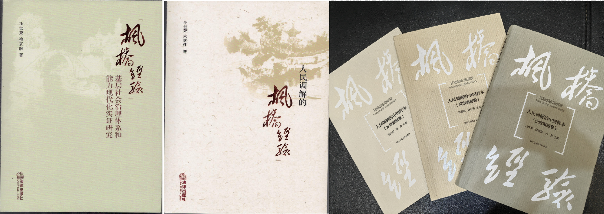
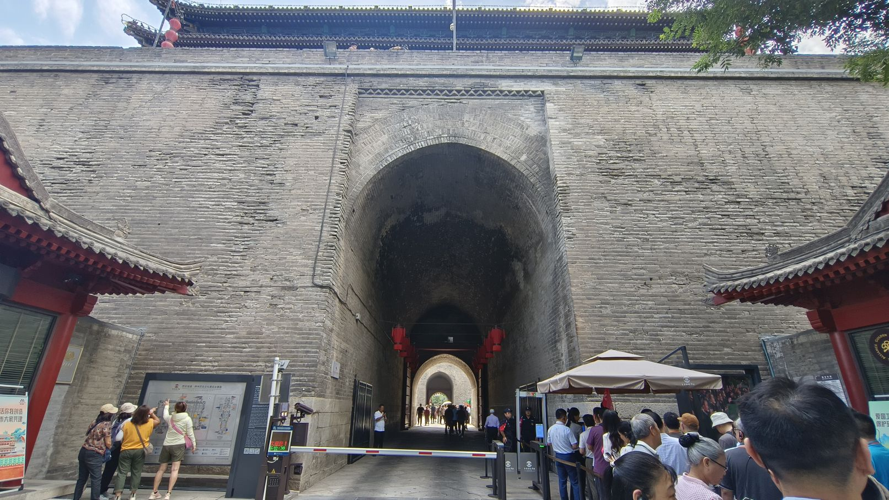
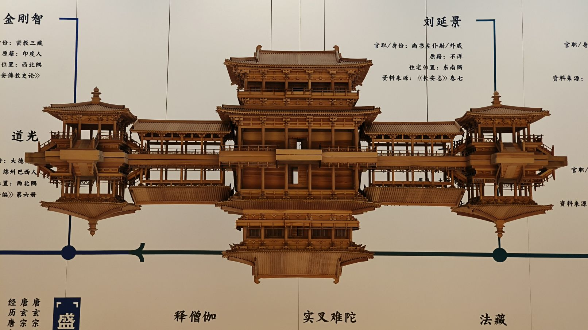

6月11-16日，有幸参加广东省法学会组织的业务能力培训班，地点在西北政法大学雁塔校区，位于陕西省西安市。虽然时间只有短短一周，但紧凑的学习课程和课后的行程经历，都给我留下深刻的印象。

## 培训课程

### 两会精神和要点解读
授课老师分别从陕西、广东角度对两会精神进行解读，特别是对前些年发生的“秦岭别墅”事件进行深入剖析，由于内容较为敏感，这里也就不再复述。
课后，来自东莞的同学还专门约大家去“秦岭别墅”事件现场观看。 但由于事情已经过去好几年了，原来的别墅违建现场，早已建成为“秦岭和谐森林公园”。

---

### 枫桥经验与社会治理创新

授课老师是枫桥经验研究和社会治理研究方面的专家，并围绕此主题出版过多本学术专著。授课过程中，有我最感兴趣的两个方面内容： 

1. 关于社区居委会和村民委员会的定位区别问题。主要涉及到社会治理过程中，村委会与居委会在职能、运转模式和参与方式等方面的差异问题。
2. 关于耕地占补平衡过程中的实施程序问题。主要涉及农村宅基地转换为耕地以及耕地指标在区域间流转过程中的一些程序疑惑。

---

### 延安精神及其当代价值

授课老师对延安革命史了然于胸信手拈来，过程中印象最深的是“西安双十二事变”以及“重庆谈判”的一些细节问题。为此，学校课后还专门安排了到西安事变纪念馆进行参观学习。

---

### 全面对外开放新格局与我国涉外法治建设的新布局

授课老师是国内国际私法方面的专家，曾跟随外交部参与国际私法协议磋商谈判。这门课，让我对近年来非常热门的涉外法治工作有了系统的、全新的了解。整体来说，国内涉外法治工作仍处于起步阶段，需要补的课非常之多，与经济政治地位严重不相匹配。这个领域，未来几十年都会成为法学学科中的绝对热门。

比如说，当讲到国内法治人才匮乏时，老师引用数据，在全国70万律师中，能够从事涉外法律实务的律师不足1万人，能够在境外参与诉讼、仲裁庭审的律师不足300人，能够在WTO等国际组织争议解决机构中提供国际法律服务的律师不足30人。在涉外法治规则和体系构建方面，目前我国在进出口贸易中选用外国法的比例占到95%以上，在国外开庭或仲裁的败诉率高达95%以上，国内涉外机构处理的案件95%以上都是内地加港澳台的案件。在联合国机构中，来自中国的公务员比例不足中国缴纳会费比例的1/15，其中从事法律事务的几乎为零，在国际法律规则构建方面，国内几乎没有参与权和话语权。

最后，这位老师也提出了几个非常具有针对性的措施，如果能被采纳，久久为功后，应该还是会部分缓解这个问题。

---

### 当前未成年人犯罪现状与对策

未成年人犯罪问题一直是我这几年关注的重点之一。在本次课上，我最关注的是授课老师提出的女性未成年人犯罪问题，之前确实接触不多。也趁着这次学习计划，进一步了解这方面情况。

总体来说，未成年女性犯罪的数量较少，但绝对数量和相对比例均呈现逐年上升的趋势，犯罪后果趋于严重，还是需要引起重视的。

#### 未成年女性犯罪的特点

1. 犯罪类型多样化、手段暴力化，且带有女性自身的特点；  
2. 共同犯罪居多，刑期以短期刑为主；  
3.  以情境性和冲动性犯罪为主；  
4.  被害人多为女性等。  
  
#### 未成年女性犯罪的心理原因

1. 在信息加工方面，关注内容低俗，学业表现不佳；    
3. 在行为调节和控制方面，犯罪动机以谋财为主，负性情绪较多，需要层次不高，价值观不正；  
4. 在心理特性方面，情绪智力低，人格不健全。在心理健康方面，在犯罪前往往长期承受巨大压力；  
5. 犯罪前常空虚无聊，多出现偏差行为；多存在心理创伤。相关部门应当据此有针对性地开展预防与教育改造工作。  

  

*焦迎娜 苏春景 于鹏 寇欣： 未成年女性犯罪的特点及其心理原因分析.预防青少年犯罪研究. 2023年第4期.*

---

### 热点案例视野中的《民法典》

授课老师是难得一见的“全才”，作为法学教授，他还教英语，做兼职律师，干过播音主持，会表演、配音（毛泽东、周恩来等），在 CCTV-12 开过专题电视法律讲堂，还有很高的书法水平。这位老师用了 10 多个简单案例，对比讲授了民法典出台后的一些变化以及存在问题。

例如，民法典虽然首次创设了关于紧急情况下施救致人损害的法律责任承担问题，仍然存在漏洞。对于施救者存在重大过失的救助行为，如果一概不承担责任，很容易导致立法目的偏离预期效果。如，使用错误灭火工具，导致火势加大，错误使用挖掘工具导致受害者加重损害，在施救过程中过失导致受害人轻伤害变重伤害甚至死亡等等，并且已经有一些实际发生的例子。

> 《民法典》第184条：因自愿实施紧急救助行为造成受助人损害的,救助人不承担民事责任。

---

### 当前中国社会热点问题分析

授课教师的特色非常鲜明，主要从当前国际国内形势分析出发，认为在今天和未来的很长一段时间里，我们都将处于一个社会大变革的时代，也处于一个“负重前行”的时代背景。如何透过当前所发生的诸多与“法治主义”关联度较高的社会热点问题，去理性地认识和拥抱时代，如何准确做好“自我定位”，尤其是在今天这个充满高度不确定性的时代。

---

## 外出学习课程

### 西安事变纪念馆

> 西安事变纪念馆（张学良公馆）是以“西安事变”重要旧址张学良公馆、杨虎城止园别墅为基础而建立的遗址性博物馆。总占地面积9141平方米。1982年2月23日，西安事变旧址被国务院命名为第二批中国重点文物保护单位。1983年10月，成立西安事变纪念馆筹建处。1986年12月，在纪念西安事变五十周年之际正式建成西安事变纪念馆，并对外开放。

---

### 明城墙遗址

> 西安城墙，是中国现存规模最大、保存最完整的古代城垣之一，是第一批全国重点文物保护单位、国家AAAAA级旅游景区，也是第一批全国重点文物保护单位中唯一的城垣建筑。广义的西安城墙包括西安唐城墙和西安明城墙，但一般特指狭义上的西安明城墙。西安明城墙位于陕西省西安市中心区，墙高12米，顶宽12—14米，底宽15—18米，轮廓呈封闭的长方形，周长13.74千米。城墙内人们习惯称为古城区，面积11.32平方千米，著名的西安钟鼓楼就位于古城区中心。

---

### 小雁塔和西安博物院

> 小雁塔，位于唐长安城安仁坊（今陕西省西安市南郊）荐福寺内，又称“荐福寺塔”，建于唐景龙年间，与大雁塔同为唐长安城保留的重要标志。小雁塔和荐福寺钟楼内的古钟合称为“关中八景”之一的“雁塔晨钟”，是西安博物院的组成部分，为国家AAAA级旅游景区。小雁塔是中国早期方形密檐式砖塔的典型作品，原有15层，现存13层，高43.4米，塔形秀丽，是唐代佛教建筑艺术遗产，佛教传入中原地区并融入汉族文化的标志性建筑。

---

### 安仁坊遗址展示馆

> 安仁坊是唐长安城外郭城108坊之一，向北距皇城仅隔两个坊。其东边为安上门街，南邻光福坊，北邻开化坊，西边紧邻唐都长安城的南北中轴线朱雀大街。安仁坊遗址展示馆坐落在小雁塔南侧，面积约6100平方米，建筑物地上两层，整个遗址区以考古发掘的唐代安仁坊宅邸遗址为展示核心，从唐代建筑和美学出发，提取唐朝文化语言，对遗址本体进行保护和展示，是唐文化风貌的又一个展示区，多维度展示了唐长安城的市井生活。

---

## 西安的夜经济

西安不愧是全国顶流网红旅游城市，在西安这几天时间，只要出了学校校门，无论到哪都是人山人海、游人如潮、熙熙攘攘一派欣欣向荣的气息，千年古都再次进入盛世，感概万千。

### 钟楼和回民街

> 西安钟楼、鼓楼，位于陕西省西安市市中心，始建于明洪武年间，有着600多年历史，是中国现存的同类建筑中体量最大、保存最完整的钟鼓楼。西安回民街（The Muslim Quarter）是西安著名的美食文化街区，西安本地人对这片区域统称“坊上”，外地游客则习惯称为“回民街”。 回民街所在北院门街道，原为清代官署区。1992年，北院门街道实行改造，将沥青路街道和两侧砖铺人行道改铺为青石，两侧按明清风格建2层楼房。1993年9月，建成仿古文化旅游街。由于此处为回族居民聚集生活之地，故名。

---

### 大雁塔广场和大唐不夜城

> 大雁塔位于唐长安城晋昌坊（今陕西省西安市南）的大慈恩寺内，又名“慈恩寺塔”。唐永徽三年（652年），玄奘为保存由天竺经丝绸之路带回长安的经卷佛像主持修建了大雁塔，最初五层，后加盖至九层，再后层数和高度又有数次变更，最后固定为所看到的七层塔身，通高64.517米，底层边长25.5米。大雁塔作为现存最早、规模最大的唐代四方楼阁式砖塔，是佛塔这种古印度佛寺的建筑形式随佛教传入中原地区，并融入华夏文化的典型物证，是凝聚了中国古代劳动人民智慧结晶的标志性建筑。 1961年3月4日，国务院公布大雁塔为第一批全国重点文物保护单位 。2014年6月22日，在卡塔尔多哈召开的联合国教科文组织第38届世界遗产委员会会议上，大雁塔作为中华人民共和国、哈萨克斯坦和吉尔吉斯斯坦三国联合申遗的“丝绸之路：长安-天山廊道的路网”中的一处遗址点成功列入《世界遗产名录》。

---

### 赛格国际购物中心

> 赛格国际购物中心总建筑面积25万平米，商业面积约19万平米，建筑格局分为地上11层、地下2层，共13层。是以购物、休闲、商务、社交、餐饮、娱乐为一体的都会型购物中心。 根据中国购物中心等级评价标准2019年评定为国家五星购物中心。

---

### 洒金桥传统民俗街

> 洒金桥位于陕西省西安市莲湖区的回坊内，北起莲湖路南至新寺巷，全长800米。在南宋和元代称为铁炉街，明代改为铁炉坊，清末以沙姓人住此街北段，得名沙家桥，后改为洒金桥。

---

### 西北政法大学

> 西北政法大学（Northwest University of Political Science and Law）简称“西法大”，坐落于陕西省会西安，由中央与陕西省共建，是一所法学特色鲜明，哲学、经济、管理、文学等多学科相互支撑、协调发展的多科性大学；是陕西省省属高水平大学、陕西省“一流学科”建设高校，入选国家首批“卓越法律人才教育培养计划”、国家级大学生创新创业训练计划，为法学传统“五院四系”成员、全国政法大学“立格联盟”和陕西高校“长安联盟”创始成员，是西北地区法学教育研究中心。西北政法大学源于中国共产党1937年创办的陕北公学和1941年的延安大学，历经西北人民革命大学、西北政法干部学校、中央政法干部学校西北分校等时期；1958年，西北大学法律系并入中央政法干部学校西北分校，成立西安政法学院；1963年更名为西北政法学院；2000年由司法部划转陕西省，成为中央与地方共建、以地方管理为主的学校；2006年更名为西北政法大学。

由于西北政法大学脱离了中央财政保障，转由陕西省负担，而陕西作为西部省份，经济实力实在一般，并且大学众多，很难给到西北政法大学很大力度支持。因此**西北政法大学预算资金在全国所有公办本科“大学”中，排名倒数第二位，仅高于西藏藏医大学。** 2024年预算资金只有3亿元。

这个排名让我感到十分惊讶，因为我原就读的佛山科学技术学院（现已更名佛山大学），在更名前是全国所有公办本科“学院”中，排名顺数第二的大学，仅次于中国民航飞行学院，2024 年预算资金为 18.3 亿元，是西北政法大学的 6 倍。

在博士点申报方面也是如此，西北政法大学已经申报博士点长达 27 年，但本轮申报仍在省内只排序陕西省第三位，获批难度较大。而佛山大学今年是第一次申报博士点，却已经排名全广东省第一序位，为这一个博士点，佛山大学已经投入 5 亿元以上。可见地方经济对大学发展之影响。

---

### 来回旅程

