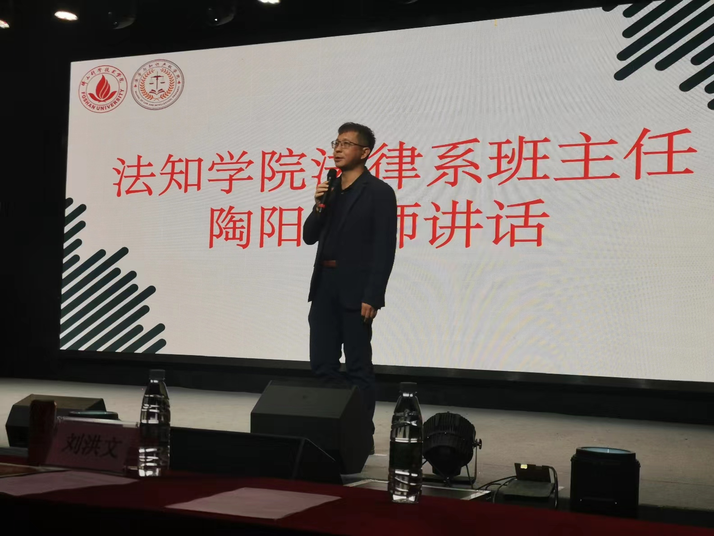
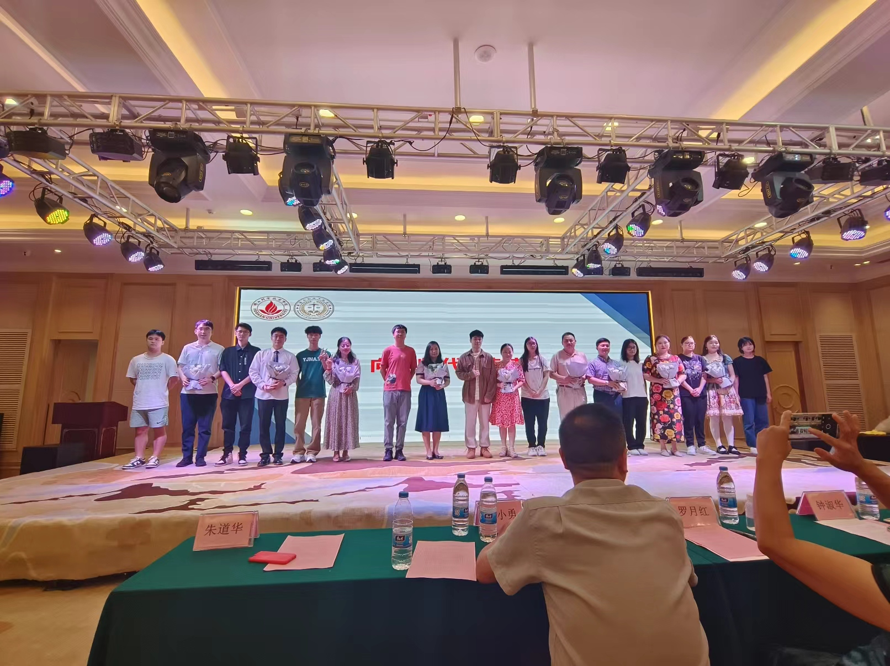
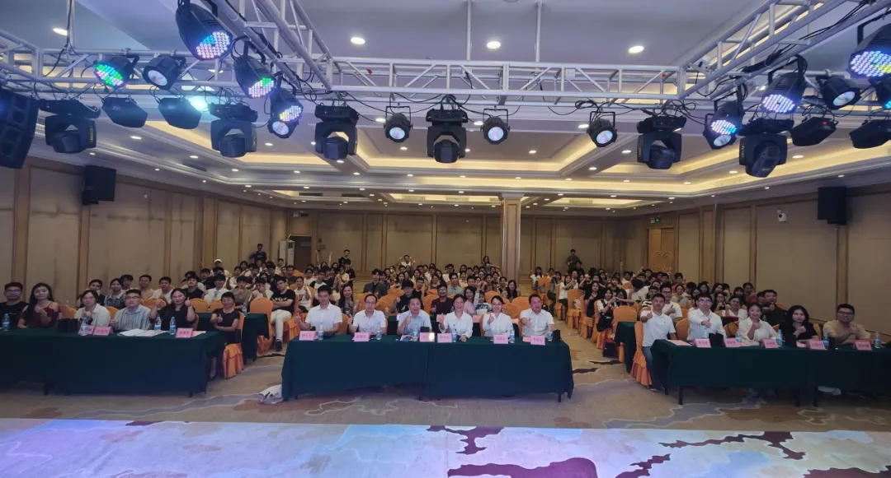

6月22日晚上，应学校老师邀请，我到佛山大学知识产权与法学院参加了2024届本科生毕业晚会活动。

这是我第四次抑或是第五次参加这项活动，主要是因为大学毕业后，在工作上仍然多次与学校老师有过一些交集，比如邀请老师过来授课，请老师帮忙做课题研究等等。可能他们也是图方便，便邀请我这个普通校友参加。

## 几次晚会经历

我印象中自己毕业那会，并不存在一个“毕业晚会”这样的形式（或许记错了也不一定，但的确没有任何印象），大抵是到了2016年之后，才以校友身份陆续参加过几次活动。这些活动无一例外都是在校外酒店举办，一方面可能是因为学校经费比较充裕，另一方面在校外举办也更容易给人以轻松的氛围。 之所以每次都去参加，主要也是为了带小孩过去提前感受一下大学生活，见见世面。

## 作为校友的期待

每次参加这个活动，我都还是有些话想对师弟师妹们唠叨下，虽然没啥用。

### 期望大家坚守法学初心

我自己以及同班同学的经历就很明显。在我毕业那会，法学专业作为全球高校就业“红牌”专业，很不受待见。同班多数人毕业后并没有从事法学法律工作。但后来才发现，那些坚持从事法学法律工作的同学，普遍都获得比较好的发展空间和机会，而转行干其他事情的，多数都四处碰壁。到头来很多同学不得不在毕业三年、五年甚至十年后才转头重新投入法学法律工作中来，此时已经错失发展黄金期。

我当年一毕业就转行 IT 行业，作为行业边缘人物，短时间内就在外包工作中认清了资本本质，于是立马回头奔赴法学法律工作，才有了今天较为安定的生活局面。

### 期盼大家投身政法事业

我们这个学院以前一直叫“政法学院”，后来因为学校办学方向调整，大幅压缩文科专业，导致学院被并入经济管理学院，直到前两年才又独立出来，成为“知识产权与法学院”，在 2023 年才招生 50 人，算是整个佛大最小的学院。“政法”在中国具有特殊的意义，政法事业涵盖了法院、检察、公安、司法行政、法学研究、法学教育等范围，包括律师、公证、仲裁也是广义政法事业的一部分。

政法事业整体来说在体制内具有一定的超然地位，重点体现在职业保护、工作待遇以及级别晋升上，值得作为一份终身事业去热爱和奋斗。

### 期待大家早日顺利就业

最近几年全国就业形势整体比较艰难，很多学生也被吓到，感觉无所适从，不知道如何就业。但按照我个人观察，佛山作为民营经济大市，法学专业整体就业压力应该在全国地级市里边还是算比较好的，光是政府招聘这块就有很大空间。不过以往很多毕业生都习惯盯着佛山市一级或市区岗位，对镇（街道）村（社区）以及郊区不够重视，错过不少工作机会。另外，在律师行业，由于佛大法学毕业生人数不多，即便是全员从事律师行业，对于佛山目前近 4000 名律师的市场容量也不会造成太大冲击。实际目前也只占佛山律师人数不到 3%，而本土佛山只有这么一所大学法学院。

佛山的法学法律行业整体收入水平还是不错的，相较其他文科或不少理工科专业来说，性价比是很高的。但是由于信息不对称这个问题始终存在，需要更多校友帮助提点、介绍，才能解决当下就业困境。

