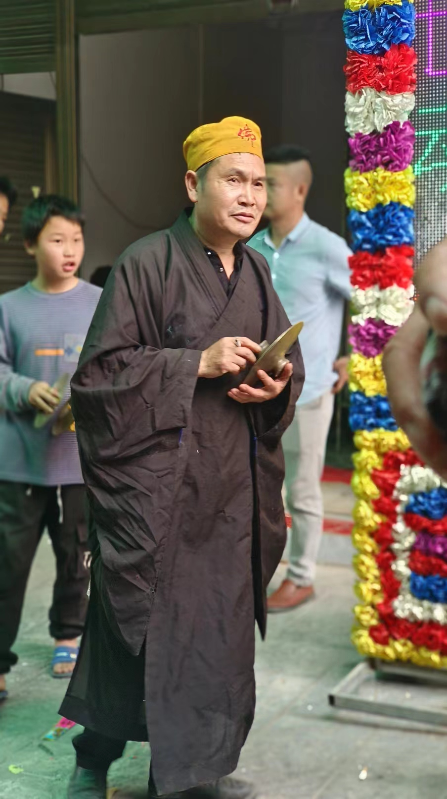
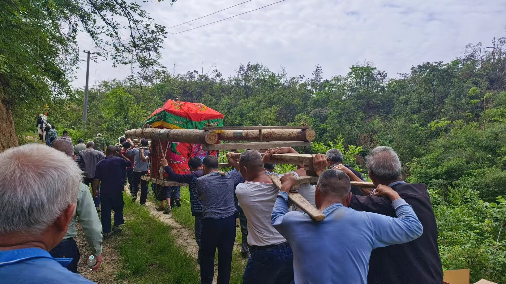

我奶奶只有三姊妹，都是 1930 年代出生，本来都很高寿，直到今年初我奶奶去世后，这次又不幸遇上奶奶的哥哥（舅公）去世。至此，在我祖父母、外祖父母这个辈分的亲戚，仅剩两位健在，一位是奶奶的妹妹（姨奶奶），另一位是爷爷最小的弟妹（叔奶奶）。

> 这些年来，已经不知道回乡参加葬礼多少回，像爷爷兄弟姐妹 9 人，外公、外婆的兄弟姐妹，以及部分堂表叔伯的葬礼我几乎都没有缺席过，只要没有极为特殊的工作情况，肯定都会回乡参加。

---

我从小就非常敬仰这位舅公。他是我所有亲戚里边第一位大学生，也是新中国成立后最早的大学生之一，毕业于湖南人民革命大学，当时还是开国大将黄克诚担任校长。曾听他说起，他毕业后就被分配到湘潭工作，还跟时任湘潭地委书记华国锋有过接触，后来为了离家近点，调回刚从湘乡县分出不久的双峰县工作，此后一直在双峰工作至退休。

我从小喜欢到舅公家去翻看他收藏的各种图书，特别是当年他退休后居住在山村老宅时那段时光。那个村离我家大概有五六里山路，全程都得爬山过去。印象最深得是他家收藏的辞海、辞源等各种“大部头”书籍，在我小时候看来，简直是无上知识的文化符号代表，手里的新华字典看起来就像小儿科一般。

---

大约是 2005 年左右，舅公家就从山上搬下来到了镇上，在镇上农贸市场旁边买地盖了两个“门面楼”，此后我便再也没有去过他原先山上的老宅。这个房子由于距离我家近很多，所以我经常过去，一进门就是满墙的字画，大多是舅公在本地的朋友书写。

---

到 2013 年左右，因为舅公的子女都在县城上班，他又在双峰县老政府大院购买了一套老式“干部房”在此养老。我每年也都会去他那探望。他每次都会拿出一些自己退休后在做的一些研究给我看，但说实话，我啥都看不懂。

---

> 今年初我奶奶去世的时候，舅公从县城回来了几次，包括去年底我堂弟结婚，也是他过来帮忙写对联。我一直觉得他身体状况应该还很不错，但实在没想到，这么快就听到这个不幸的消息。

这次葬礼也确实是很辛苦，由于葬礼整体上是在镇上的门面房举办，而安葬地点在山上老宅的后山，因此过程中很多事情都没有那么便利。特别是送舅公上山的路上，还得先用货车将灵柩送到山脚下，再走那条很多年都没有人走过的土路上去。幸好有人帮忙将那条土路又重新修葺一番，不然是几乎没可能走得过去的。

斯人已逝，精神长存。